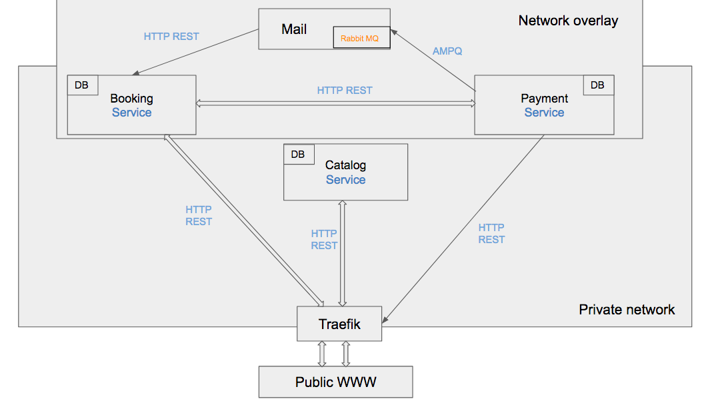

# DevOps Module

### Advancements:

- 1). Install Ansible :negative_squared_cross_mark: (this is too hard for me)
- 2). Install Docker Cluster via Ansible
    - :white_check_mark: Provision 3 VM
    - :white_check_mark: Install docker on VM
    - :white_check_mark: Enable Swarm
    - :white_check_mark: Configure Swarm Manager
    - :white_check_mark: Configure Swarm Workers
- 3). Deploy a Docker Registry
    - :white_check_mark: Configure the Docker Registry
    - :white_check_mark: Run the Docker Registry
- 4). Deploy TICK stack via Ansible
    - :white_check_mark: Pull & Build docker images
    - :white_check_mark: Push images to the Docker Registry
    - :white_check_mark: Updates the Docker Registry images
    - :white_check_mark: Deploy tick_stack on Docker Swarm cluster
- 5). Build Continuous Integration & Continuous Deployment infrastructures
    - :white_check_mark: Install & configure a GITLAB instance on the manager node
- 6). Build & Configure CI & CD pipeline
    - :negative_squared_cross_mark: Configure pipeline to run test inside docker container
- 7). :white_check_mark: Deploy Reverse Proxy & Load Balancing solution (Traefik)
- :negative_squared_cross_mark: (BONUS) Deploy Elastic Search & Kibana

## Subject

- [Subjects](docs/subjects/subject.png)
- [Subjects Extends](docs/subjects/extends.pdf)

## Install :

Take a look at [install guide](docs/install.md).

## Docker helps :

Take a look at [docker helps](docs/docker.md).

## Urls :

- Swarm Mode inside the 3 VM

    VM ip address is [192.168.42.100, 192.168.42.110, 192.168.42.120]

    host:

    - Traefik 80 [http://192.168.42.100](http://192.168.42.100) (not configured yet)
    - Traefik manager [http://192.168.42.100:8080](http://192.168.42.100:8080)
    - Docker visualizer [http://192.168.42.100:81](http://192.168.42.100:81)
    - Mongo Express [http://192.168.42.100:82](http://192.168.42.100:82) (id:etna, pass:devops)
    - Catalog API [http://192.168.42.100:8100/catalogs](http://192.168.42.100:8100/catalogs)
    - Booking API [http://192.168.42.100:8200/booking](http://192.168.42.100:8200/booking)

    - Gitlab [http://192.168.42.100:8000](http://192.168.42.100:8000)

## Architecture :

Schema v1

